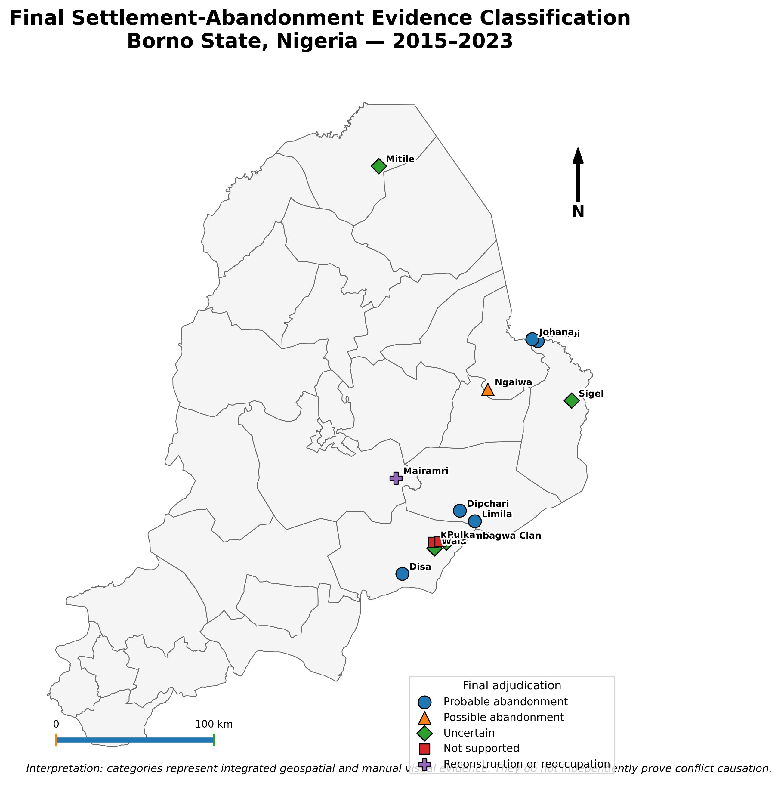
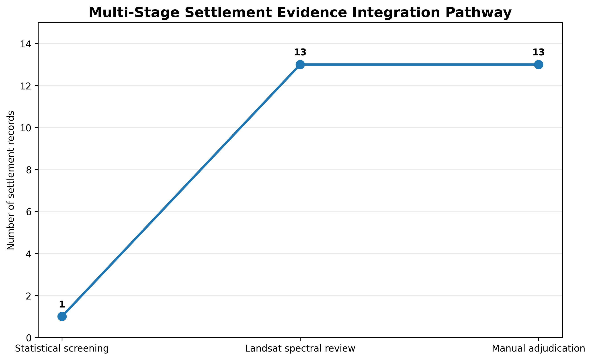
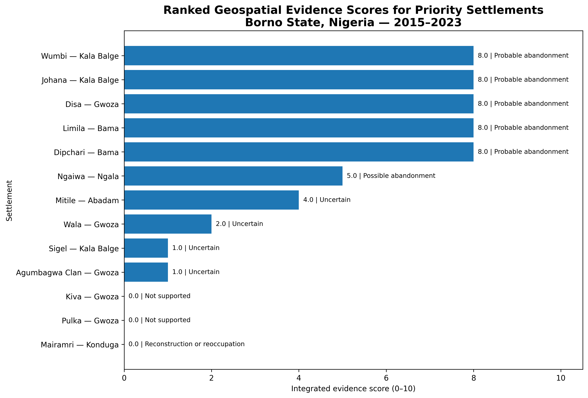
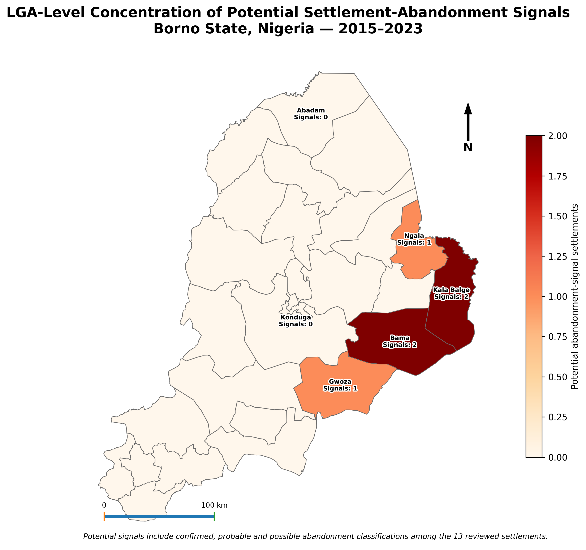
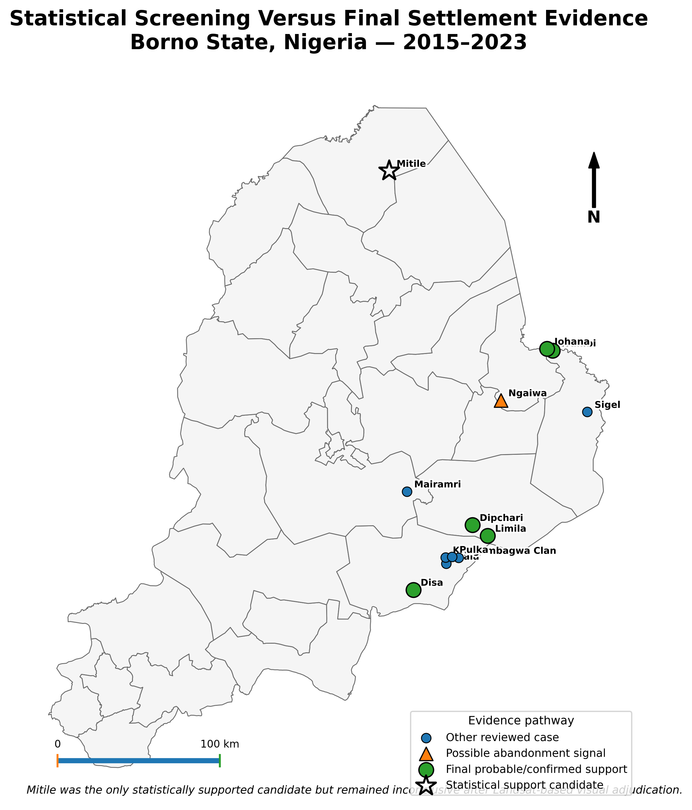
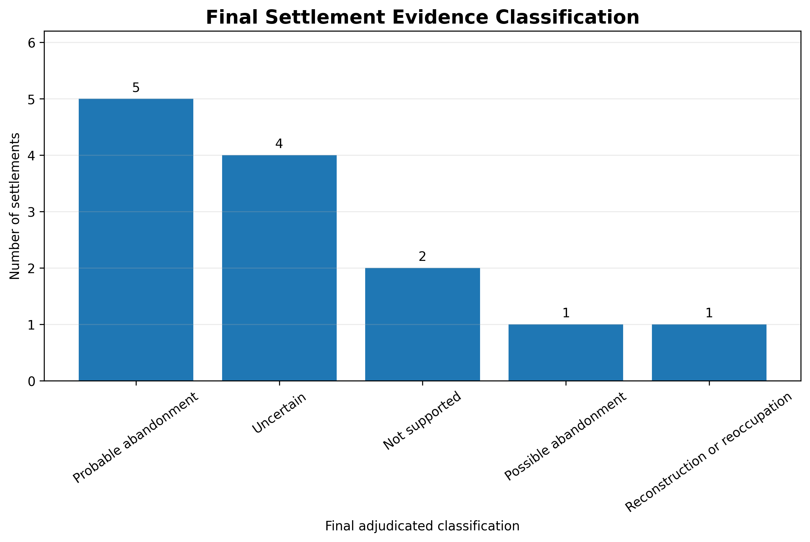

# Conflict-Induced Displacement and Settlement Abandonment Detection — Borno State, Nigeria

**An integrated geospatial assessment of settlement decline, displacement pressure and evidence of abandonment across Borno State between 2015 and 2023.**

<p align="center">
  
</p>

Conflict and displacement can alter settlement systems in ways that are difficult to measure from a single dataset. Population estimates may show decline, satellite imagery may reveal physical change, and conflict records may indicate exposure, but none of these indicators independently confirms abandonment. This project therefore used a multi-indicator evidence framework to screen **2,455 settlements across all 27 LGAs of Borno State**, then subjected a focused set of candidate settlements to detailed validation and manual adjudication.

The assessment combined population change, built-up change, vegetation and built-up spectral indicators, settlement-level conflict exposure, satellite comparison and contextual review. Thirteen candidate settlements across six LGAs were examined in detail. The final evidence classification identified **five probable abandonment cases**, **one possible abandonment case**, **four uncertain cases**, **two cases not supported as abandonment**, and **one case showing reconstruction or reoccupation**. No settlement was classified as confirmed abandonment.

The results demonstrate why conflict-related settlement change must be interpreted cautiously. Statistical decline alone did not always agree with final visual and contextual evidence. The final classification therefore reflects convergence across multiple indicators rather than a single threshold or automated label.

| Project detail | Information |
|---|---|
| **Study area** | Borno State, Nigeria |
| **Study period** | 2015–2023 |
| **Settlements screened** | 2,455 |
| **LGAs covered** | 27 |
| **Detailed validation cases** | 13 settlements across 6 LGAs |
| **Primary methods** | Population change, built-up change, spectral analysis, conflict exposure, visual validation and manual adjudication |
| **Final evidence classes** | Probable, possible, uncertain, not supported, reconstruction/reoccupation |

## Key findings

- **5 settlements** were classified as probable abandonment.
- **1 settlement** was classified as possible abandonment.
- **4 settlements** remained uncertain after manual adjudication.
- **2 settlements** were not supported as abandonment cases.
- **1 settlement** showed evidence of reconstruction or reoccupation.
- **0 settlements** were classified as confirmed abandonment.
- **Wumbi** was the highest-ranked settlement in the final evidence scoring.
- **Kala Balge** was the highest-ranked LGA.
- Borno's estimated population increased from **5,961,054 in 2015** to **7,342,382 in 2023**, a reported increase of **23.17%** at the statewide scale.
- Gwoza contained the largest number of detailed validation cases, while Bama and Kala Balge contained multiple probable-abandonment cases.

## Evidence pathway

The analytical process moved from broad screening to increasingly detailed validation:

1. Screened 2,455 populated places.
2. Integrated settlement-level conflict exposure and displacement context.
3. Measured population and built-environment change.
4. Evaluated NDVI, NDBI and Landsat visual evidence.
5. Assessed temporal consistency and multi-indicator convergence.
6. Constructed a four-indicator settlement typology.
7. Reviewed candidate settlements through manual adjudication.
8. Assigned final evidence classes and confidence levels.
9. Summarised findings by settlement and LGA.



## Selected outputs

### Ranked settlement evidence scores



### Final settlement evidence classification


### LGA concentration of potential abandonment



### Statistical versus final evidence



### Final decision distribution



## Interpretation

The project does not claim that remotely sensed decline automatically proves settlement abandonment. Confirmed abandonment requires stronger evidence than population loss, reduced night-time activity or spectral change alone. The final decisions therefore distinguish between probable, possible, uncertain and unsupported cases, while also recognising reconstruction or reoccupation.

The statewide population increase does not contradict local settlement decline. State-level population growth can occur alongside displacement, urban concentration, camp populations, return movements and decline in individual settlements.

These outputs are planning and humanitarian decision-support evidence. They should be combined with field verification, local knowledge, security assessments and updated displacement records before operational use.

## Repository structure

```text
.
├── assets/                  # Project cover and social preview
├── data/processed/tables/   # Settlement, LGA and validation results
├── docs/                    # Methods, limitations, summary and closure notes
├── notebooks/               # Results-review notebook
├── outputs/
│   ├── maps/                # Four final maps
│   └── figures/             # Five publication figures
├── scripts/python/          # Result-reproduction script
├── validation/              # Selected validation registers and repository checks
├── CITATION.cff
├── LICENSE
├── README.md
├── project.json
└── requirements.txt
```

## Reproducibility

This repository publishes the final analytical evidence, result tables, maps and validation records. The master project archive contains the complete staged production history and intermediate remote-sensing assets. The public repository focuses on the final, reviewable evidence package.

```bash
pip install -r requirements.txt
python scripts/python/reproduce_summary.py
python validation/validate_repository.py
```

## Author

**Abdullah Abdazeez Ayomide**  
Geo-spatial Planner | GIS & Remote Sensing Analyst

- [GitHub](https://github.com/Abdullahabdazeez)
- [LinkedIn](https://ng.linkedin.com/in/abdazeez-abdullah-4b814719a)
- [Email](mailto:abdazeezabdullah1@gmail.com)

## Citation and licence

Citation metadata is provided in [`CITATION.cff`](CITATION.cff). Code and original documentation are released under the MIT License. External datasets retain their original licences and access conditions.
