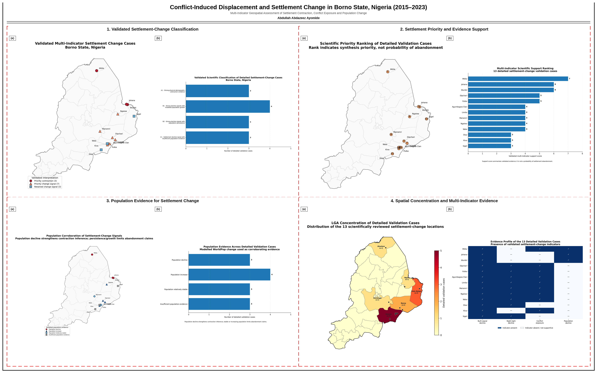
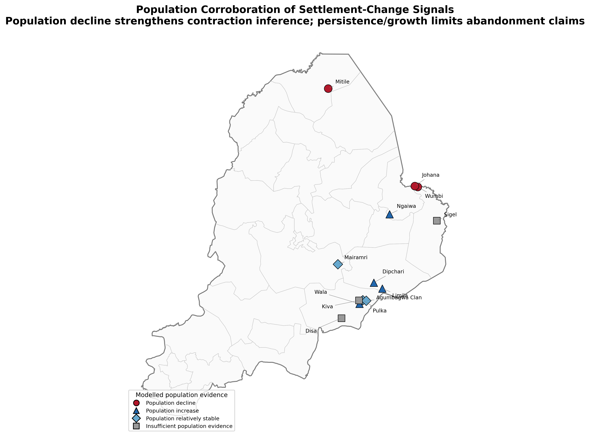
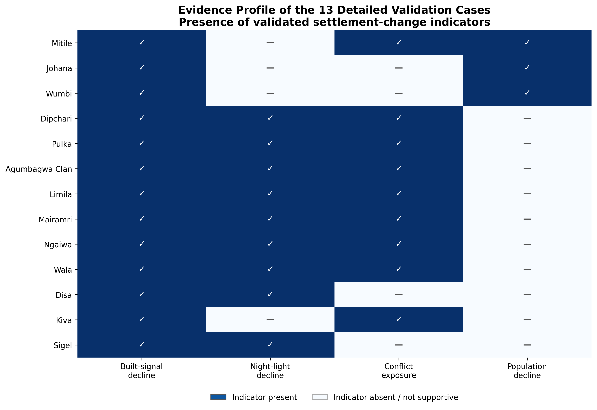
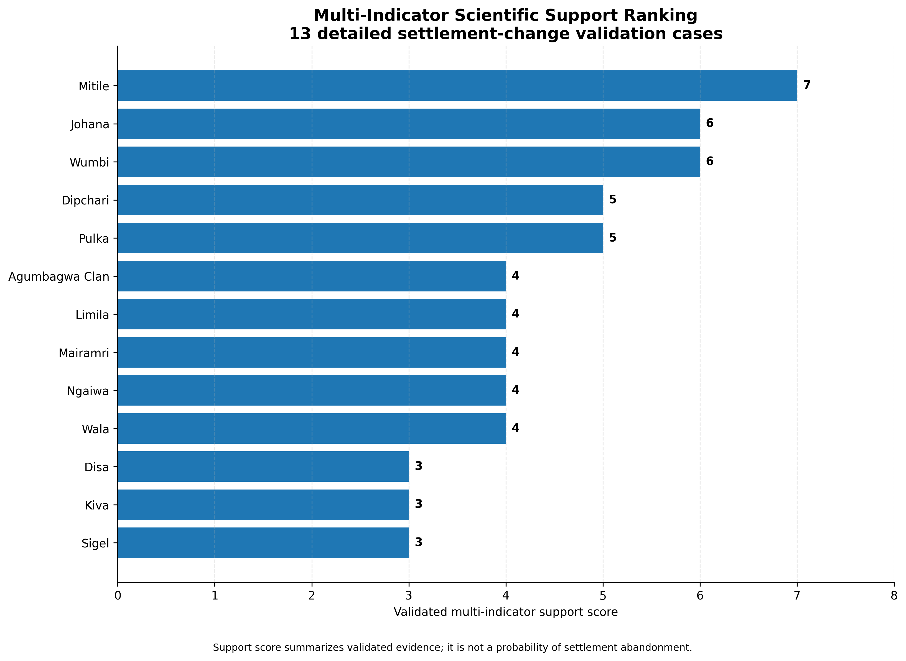
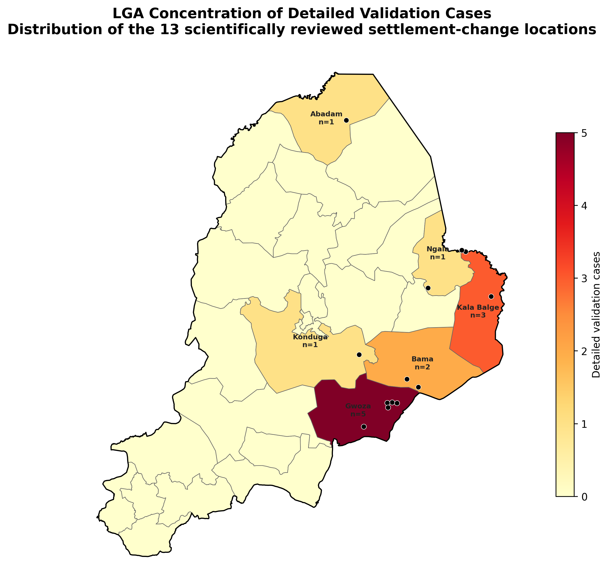

# Conflict-Induced Displacement and Settlement Change in Borno State, Nigeria (2015–2023)



## Overview

This project examines settlement change across Borno State between 2015 and 2023. I used several geospatial datasets together because no single indicator can reliably show whether a settlement has contracted, remained active or been abandoned.

The analysis screened **2,455 settlements across all 27 LGAs in Borno State**. I combined built-up change, night-time lights, conflict exposure and modelled population change, then examined **13 settlements in detail**.

The final interpretation identified **3 priority contraction cases**, **7 priority change-signal cases**, and **3 retained cases where population evidence was insufficient**. None of the 13 cases is presented as a confirmed abandoned settlement.


---

## Research Question

**Where do multiple geospatial indicators point to meaningful settlement contraction or change across conflict-affected Borno State?**

---

## Study Area

The study covers **Borno State, north-eastern Nigeria**, including all **27 Local Government Areas**. The settlement screening included **2,455 populated places**.

The 13 detailed validation cases are located in:

- Abadam
- Bama
- Gwoza
- Kala Balge
- Konduga
- Ngala

---

## Why This Matters

Conflict can affect settlements in different ways. People may leave, return or relocate. Buildings may be damaged or removed. Night-time activity may reduce. Some settlements may also recover while others continue to decline.

Because these processes do not always move together, I avoided using a single dataset as proof of settlement abandonment. Instead, I compared different indicators and used the level of agreement between them to guide the final interpretation.

---

## Data Sources

| Dataset | Main Use |
|---|---|
| GeoNames populated places | Settlement locations and statewide screening |
| ACLED | Conflict exposure around settlements |
| VIIRS night-time lights | Change in detected night-time activity |
| Dynamic World / satellite-derived built-up outputs | Built-signal change |
| WorldPop | Modelled population change |
| Borno administrative boundaries | State and LGA spatial context |

More detail is available in [`05_Documentation/data_sources.md`](05_Documentation/data_sources.md).

---

## Methodology

The workflow followed five main steps:

1. **Statewide settlement screening**  
   I organised evidence for 2,455 settlements across Borno State.

2. **Built-up change assessment**  
   I examined settlement-level changes in the detected built signal between 2015 and 2023.

3. **Night-time light assessment**  
   I tested whether settlements showed temporally consistent decline in VIIRS night-time lights.

4. **Conflict and population context**  
   I compared settlement-level conflict exposure with modelled population change.

5. **Multi-indicator validation**  
   I reviewed the evidence together and retained 13 locations for detailed interpretation.

The final classification was based on how the indicators agreed or disagreed, rather than on a single threshold.

See [`05_Documentation/methodology.md`](05_Documentation/methodology.md) for the full summary.

---

## Key Findings

### 1. Three settlements showed the strongest contraction evidence

The strongest cases were:

| Rank | Settlement | LGA | Evidence support score |
|---:|---|---|---:|
| 1 | Mitile | Abadam | 7 |
| 2 | Johana | Kala Balge | 6 |
| 3 | Wumbi | Kala Balge | 6 |

These locations combined strong physical decline signals with modelled population decline. They were therefore retained as **priority contraction cases**.


---

### 2. Seven settlements showed important change signals, but population evidence limited the interpretation

The seven priority change-signal cases were:

- Dipchari
- Pulka
- Agumbagwa Clan
- Limila
- Mairamri
- Ngaiwa
- Wala

Several of these locations showed strong built-up, night-light or conflict-related evidence while modelled population remained stable or increased.

For that reason, I did **not** describe them as abandoned settlements.



---

### 3. Three cases retained change signals but lacked sufficient population evidence

The three retained cases were:

- Disa
- Kiva
- Sigel

These locations remained useful for follow-up, but the available population evidence was not strong enough to support a more confident demographic interpretation.

---

### 4. Population evidence materially changed the final interpretation

Across the 13 detailed cases:

- **3** showed population decline
- **4** showed population increase
- **3** were relatively stable
- **3** had insufficient population evidence

This is why the project separates **settlement contraction/change evidence** from **confirmed abandonment**.


---

## Evidence Profile

The final 13 cases were compared using four main evidence groups:

- built-signal decline
- night-time light decline
- conflict exposure
- population decline



The evidence profile shows that the detailed cases do not all represent the same process. Some indicators agree strongly, while others point in different directions.

---

## Settlement Priority

The support score helps organise the final cases according to the amount of validated evidence available.

It is **not a probability of abandonment**.



---

## Spatial Pattern

The detailed cases are concentrated mainly in eastern and south-eastern Borno, particularly in **Gwoza, Kala Balge and Bama**.



---

## Final Interpretation

The project produced three broad public-facing groups:

| Group | Number of cases | Interpretation |
|---|---:|---|
| Priority contraction | 3 | Strong physical-demographic contraction evidence |
| Priority change signal | 7 | Important change signals, but population evidence does not support a simple abandonment interpretation |
| Retained change signal | 3 | Change signals retained, but population evidence is insufficient |

**Confirmed abandoned settlements: 0.**

This project therefore identifies places that deserve closer investigation; it does not claim to prove abandonment from satellite data alone.

---

## Planning and Research Use

The results can support:

- targeted field verification
- high-resolution imagery review
- conflict-sensitive settlement monitoring
- prioritisation of locations for further demographic investigation
- comparison with displacement records and local knowledge
- future monitoring of decline, persistence or recovery

---

## Limitations

The main limitations are:

- WorldPop is a modelled population surface, not a direct settlement census.
- Night-time lights are affected by electricity access, settlement size and sensor characteristics.
- Built-up change does not directly show whether buildings are occupied.
- Conflict exposure does not prove that a specific settlement change was caused by a specific event.
- The 13 detailed cases are not a statistically representative sample of all settlements in Borno State.
- Direct field evidence is still needed before confirming settlement abandonment.

See [`05_Documentation/limitations.md`](05_Documentation/limitations.md).

---

## Maps

| Map | Description |
|---|---|
| [`01`](01_Maps/01_Validated_Settlement_Change_Classification.png) | Final validated settlement-change classification |
| [`02`](01_Maps/02_Final13_Priority_Ranking.png) | Priority ranking of the 13 detailed cases |
| [`03`](01_Maps/03_Population_Evidence_for_Settlement_Change.png) | Population evidence used to support or limit interpretation |
| [`04`](01_Maps/04_LGA_Detailed_Case_Concentration.png) | LGA concentration of detailed cases |

---

## Charts

| Chart | Description |
|---|---|
| [`01`](02_Charts/01_Validated_Class_Distribution.png) | Final class distribution |
| [`02`](02_Charts/02_Final13_Evidence_Support_Ranking.png) | Evidence-support ranking |
| [`03`](02_Charts/03_Final13_Evidence_Profile.png) | Multi-indicator evidence profile |
| [`04`](02_Charts/04_Population_Interpretation_Distribution.png) | Population interpretation distribution |

---

## Repository Structure

```text
Borno_GitHub_COMPLETE_VALIDATED/
├── README.md
├── Repository_Asset_Manifest.csv
├── 01_Maps/
├── 02_Charts/
├── 03_Data/
├── 04_Validation/
├── 05_Documentation/
├── 06_Project_Board/
├── 07_Report/
└── 08_Scripts/
```

---

## Tools

Python, GeoPandas, Rasterio, Google Earth Engine, VIIRS, Dynamic World, WorldPop, ACLED, QGIS and ArcGIS.

---

## Author

**Abdullah Abdazeez Ayomide**  
Geo-spatial Planner | GIS & Remote Sensing Analyst | Environmental & Urban Planning Researcher

