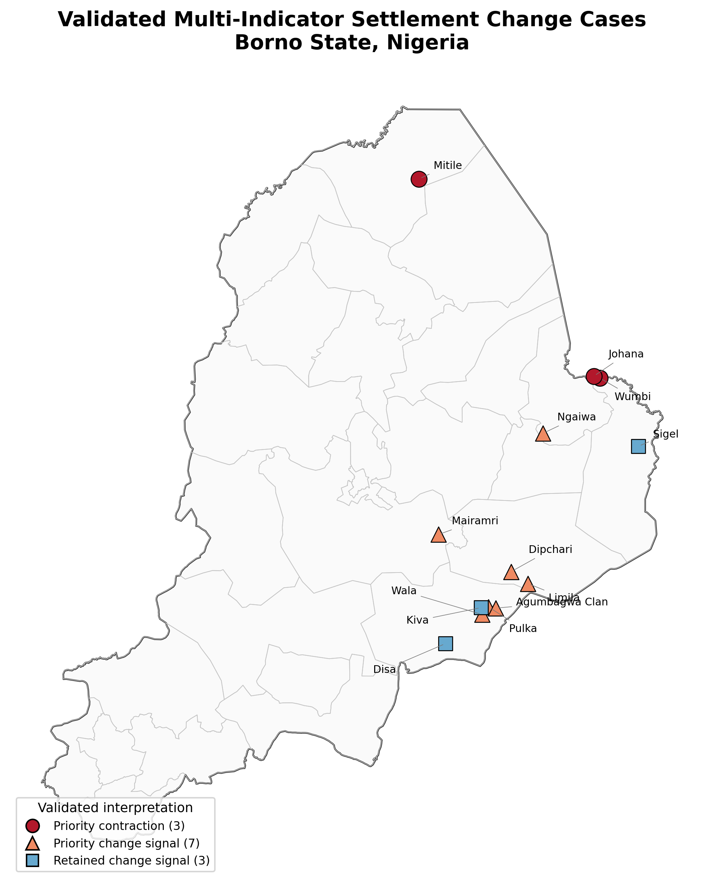
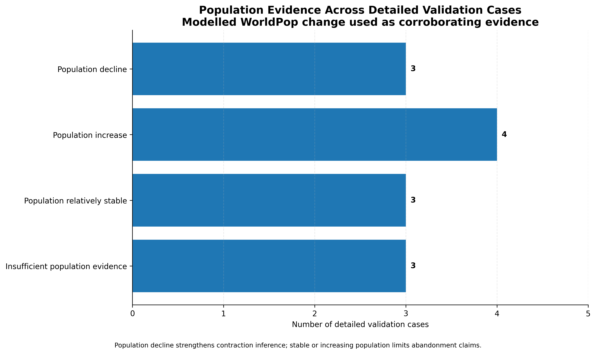

# Settlement Change in Conflict-Affected Borno State, Nigeria, 2015–2023

  

## What this project asks

Where do several independent geospatial indicators point to meaningful settlement contraction or change across conflict-affected Borno State?

I screened **2,455 settlements across all 27 LGAs** and then examined **13 locations in detail** using built-up change, night-time lights, conflict exposure and modelled population change.

The most important lesson from the project is that a settlement can show strong decline signals in one dataset and still look different in another. For that reason, I do **not** use satellite evidence alone to label a place as abandoned.

## Final interpretation

| Group | Cases | Meaning |
|---|---:|---|
| Priority contraction | **3** | Strong physical and demographic contraction evidence |
| Priority change signal | **7** | Important change signals, but population evidence does not support a simple abandonment interpretation |
| Retained change signal | **3** | Change signals remain, but population evidence is insufficient |
| Confirmed abandoned settlements | **0** | No case is presented as confirmed abandonment |

The three strongest contraction cases are **Mitile, Johana and Wumbi**.

  

## Why I used several indicators

Conflict can affect settlements in different ways. People may leave and later return. Buildings may be damaged while some residents remain. Night-time lights may fall because of electricity disruption rather than depopulation. Population models can also disagree with physical change seen in imagery.

Using several indicators together does not remove uncertainty, but it makes it much harder to mistake one signal for proof.

## Data used

| Dataset | What I used it for |
|---|---|
| GeoNames populated places | Statewide settlement screening |
| ACLED | Conflict exposure around settlements |
| VIIRS night-time lights | Change in night-time activity |
| Dynamic World / satellite-derived built-up outputs | Built-signal change |
| WorldPop | Modelled population change |
| Borno administrative boundaries | State and LGA context |

More detail is available in [`docs/DATA_SOURCES.md`](docs/DATA_SOURCES.md).

## How I built the analysis

1. Organised evidence for 2,455 settlements across Borno State.
2. Measured settlement-level change in the detected built signal between 2015 and 2023.
3. Tested whether night-time lights showed a consistent decline.
4. Added conflict exposure and modelled population change as context.
5. Compared the indicators rather than allowing one dataset to decide the result.
6. Retained 13 settlements for detailed interpretation.

The final classification is based on the pattern of agreement and disagreement across the evidence, not on one simple threshold.

Full method: [`docs/METHODOLOGY.md`](docs/METHODOLOGY.md).

## The strongest contraction cases

| Rank | Settlement | LGA | Evidence support score |
|---:|---|---|---:|
| 1 | **Mitile** | Abadam | **7** |
| 2 | **Johana** | Kala Balge | **6** |
| 3 | **Wumbi** | Kala Balge | **6** |

These three locations combine strong physical decline signals with modelled population decline, so I keep them as priority contraction cases rather than confirmed abandonment cases.

## Why population evidence changed the conclusion

  

Across the 13 detailed cases:

- **3** show population decline;
- **4** show population increase;
- **3** are relatively stable; and
- **3** have insufficient population evidence.

That pattern makes a blanket abandonment label difficult to defend.

  

## Evidence profile

  

The chart makes the disagreement between indicators visible. Some cases have strong support across several evidence groups, while others are mixed.

The support score is a way to organise the evidence. It is **not a probability of abandonment**.

## Where the detailed cases are concentrated

  

The detailed cases are concentrated mainly in eastern and south-eastern Borno, especially around **Gwoza, Kala Balge and Bama**.

## What this means for planning and research

The project is best used to identify places that deserve closer investigation. The outputs can support field verification, higher-resolution imagery review, conflict-sensitive settlement monitoring and comparison with displacement records or local knowledge.

The analysis is not a substitute for field evidence. It tells us where several signals are unusual enough to justify attention.

## Limitations

WorldPop is a modelled population surface rather than a settlement census. Night-time lights depend on electricity access and settlement size. Built-up change does not tell us whether buildings are occupied, and conflict exposure does not prove that a specific event caused a specific settlement change.

The 13 detailed cases are also not a statistically representative sample of all Borno settlements.

See [`docs/LIMITATIONS.md`](docs/LIMITATIONS.md).

## Outputs

- [`assets/maps`](assets/maps/) — final maps
- [`assets/charts`](assets/charts/) — analytical charts
- [`data`](data/) — final data tables
- [`docs`](docs/) — method, data and limitations
- [`reports`](reports/) — final report
- [`scripts`](scripts/) — analysis workflow notes

## Tools

Python · GeoPandas · Rasterio · Google Earth Engine · VIIRS · Dynamic World · WorldPop · ACLED · QGIS · ArcGIS

## Author

**Abdullah Abdazeez Ayomide**  
Geospatial Planner · GIS & Remote Sensing Analyst · Urban & Environmental Planning Researcher

[GitHub](https://github.com/Abdullahabdazeez) · [LinkedIn](https://ng.linkedin.com/in/abdazeez-abdullah-4b814719a)
